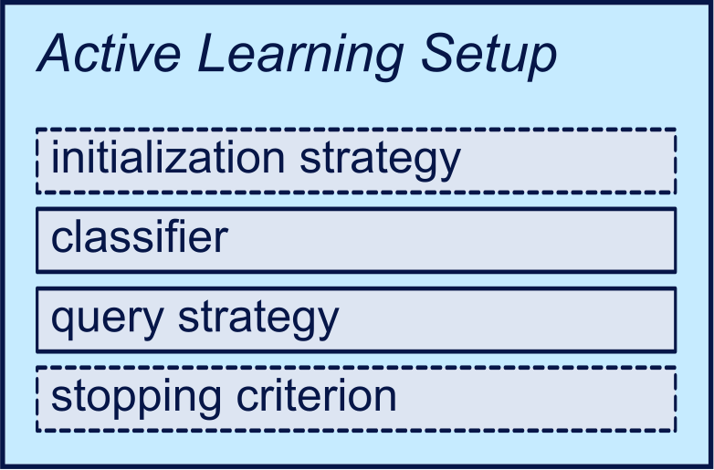

===============
Active Learning
===============

`Active learning <https://en.wikipedia.org/wiki/Active_learning_(machine_learning)>`_ aims at creating training data for classification algorithms in a very efficient manner,
for cases in which a large amount of unlabeled data is available but labels are not.
Labeling such data is usually time-consuming and expensive.
To avoid having to label the entire dataset, active learning selectively chooses data points that are assumed to improve the model.
This is done iteratively, in a process that alternates between an algorithm selecting data to label,
and a human annotator who assigns the true labels to given samples.
The goal here is to maximize the quality of the model while keeping the annotation efforts at a minimum.
A comprehensive introduction to active learning can be found in (Settles, 2010) [Set10]_.

Components
==========

.. py:currentmodule:: small_text.active_learner

An active learning process encompasses several, usually interchangeable components:
An :doc:`initalization strategy<components/initialization>`,
a classifier,
a :doc:`query strategy<components/query_strategies>`,
and (optionally) a :doc:`stopping criterion<components/stopping_criteria>`.

  A schematic of component types within an active learning setup.

You can mix and match these around the :py:class:`PoolBasedActiveLearner` which results in
a full active learning setup in just a few lines of code.
In some cases, however, there may be conceptually incompatible components,
e.g. a :py:class:`gradient-based query strategy <small_text.integrations.pytorch.query_strategies.strategies.ExpectedGradientLength>`
requires a classifier that has gradients,
but in general the library does not impose any restrictions.

Initialization Strategies
-------------------------

While there are exceptions, in many cases you will already need an initial model to apply
a query strategy. This may sound like a contradiction, since you are using active learning
to create a model in the first place, but usually a weak model using very few training instances
suffices.

* In a practical settings this can be solved by manually labeling some instances for each class.
* In the experiment setting, we simulate the choice of the initial samples.

For the latter case, we use :doc:`initalization strategies<components/initialization>`,
which select an initial set of documents.
They are just sampling methods which take the label distribution into account.

Query Strategies
----------------

:doc:`Query strategies<components/query_strategies>` decide which instances from the pool of
unlabeled data will be labeled next. They are the most critical component as they influence
both the effectiveness as well as the efficiency. Moreover, they exists in many different forms,
which can yield different results and varying runtimes. In case you are not sure which one to choose:
Uncertainty-based query strategies [LG94]_ have been shown to be a strong (and conceptually simple)
baseline for both traditional and modern [SNP22]_ classification models.

Stopping Criteria
-----------------

How often do we need to query the dataset? :doc:`Stopping criteria<components/stopping_criteria>`
give you an indication whether the active learning process should be stopped or not.

